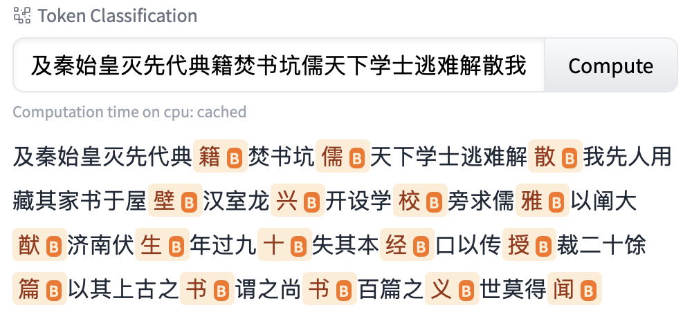
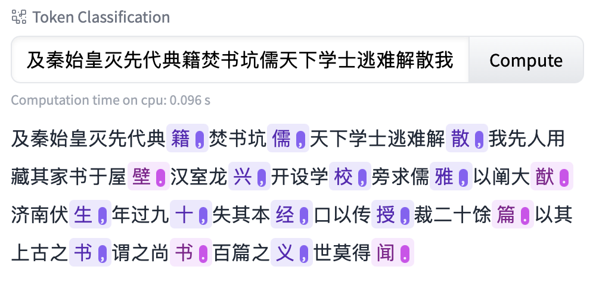
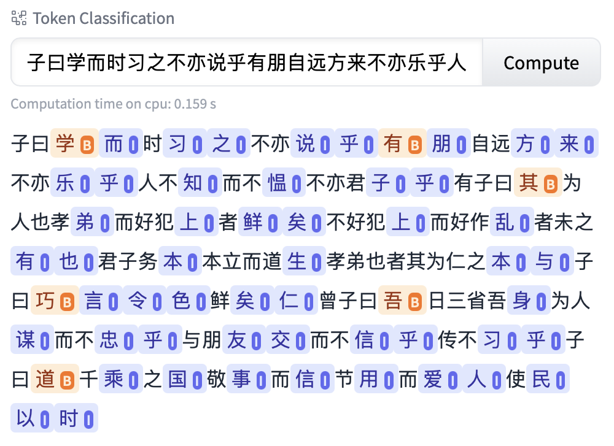
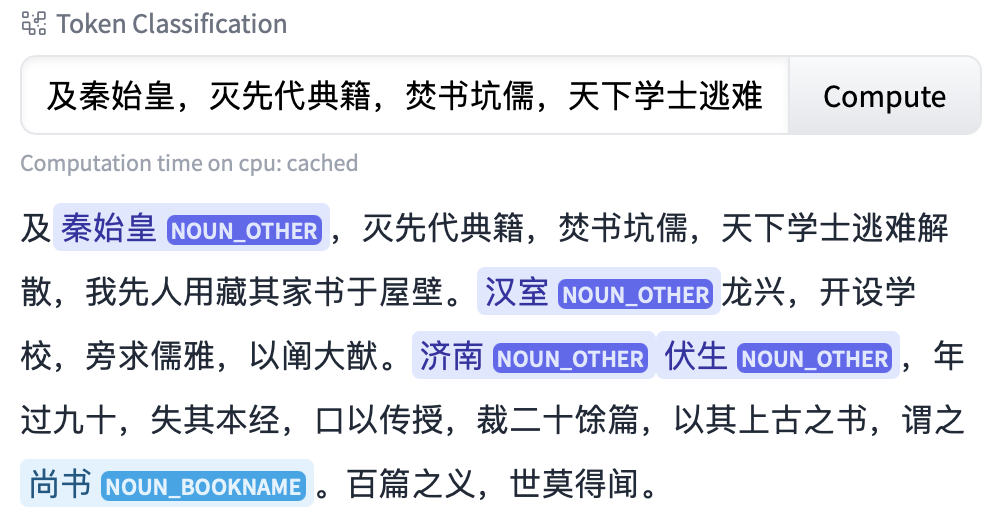
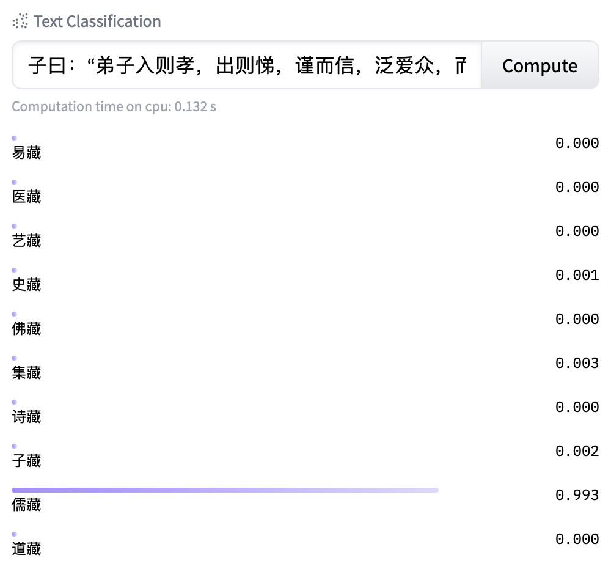
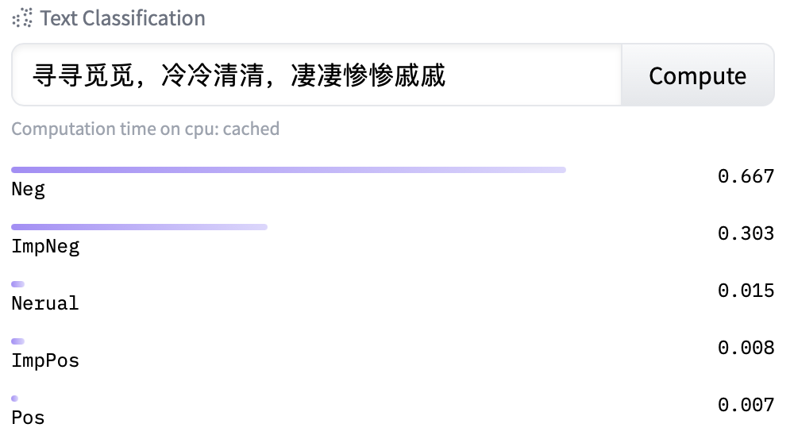

     
    
     

古文自然语言处理模型合集，收录互联网上的古文相关模型及资源。[在线演示](https://cclue.top/guwen-models.html)

更多内容请参考：

## 古文预训练语言模型

古文预训练语言模型是处理各种古文任务的基础模型，需要结合各种下游任务数据微调，才能发挥最大作用。这里收集了所有互联网上公开的古文预训练语言模型：

| 名称                                   | 简/繁 | 下载链接           | 备注                    |
|--------------------------------------|-----|----------------|-----------------------|
| guwenbert-base                       | 简   | [Hugging Face](https://huggingface.co/ethanyt/guwenbert-base) | 基于殆知阁语料和中文模型训练        |
| guwenbert-large                      | 简   | [Hugging Face](https://huggingface.co/ethanyt/guwenbert-large) |                       |
| guwenbert-fs-base                       | 简   | [One Drive](https://1drv.ms/u/s!AuBc6K5UDq9Um1AgkbHqwCVCnB7O?e=XbGssd) | 基于殆知阁语料从头训练       |
| roberta-classical-chinese-base-char  | 简繁  | [Hugging Face](https://huggingface.co/KoichiYasuoka/roberta-classical-chinese-base-char) | 基于guwenbert训练，扩展了繁体词表 |
| roberta-classical-chinese-large-char | 简繁  | [Hugging Face](https://huggingface.co/KoichiYasuoka/roberta-classical-chinese-large-char) |                       |
| sikubert                             | 繁   | [Hugging Face](https://huggingface.co/SIKU-BERT/sikubert) | 基于四库全书语料和中文模型训练       |
| sikuroberta                          | 繁   | [Hugging Face](https://huggingface.co/SIKU-BERT/sikuroberta) |                       |

## 古文应用模型

古文应用模型是基于古文预训练模型，结合特定领域数据微调得到的模型，能够实现古文的各种实际应用。其中guwen-X模型使用的训练数据可以在[CCLUE](https://github.com/ethan-yt/cclue)中下载，如果输入包含繁体字请先使用本页最下方提到的工具进行转换。

### 古文断句

[guwen-seg](https://huggingface.co/ethanyt/guwen-seg): 基于guwenbert-fs-base的断句模型。

### 古文标点

[guwen-punc](https://huggingface.co/ethanyt/guwen-punc): 基于guwenbert-fs-base的标点模型。

### 古文引号检测

[guwen-quote](https://huggingface.co/ethanyt/guwen-quote): 基于guwenbert-fs-base的引号检测模型。

> 注意：如下图所示，使用Transformers自带的序列标注模型存在一定误差，请在实际场景中使用CRF模型解码。相关代码参考 [crf_example.ipynb](./crf_example.ipynb)。

### 古文命名实体识别

[guwen-ner](https://huggingface.co/ethanyt/guwen-ner): 基于guwenbert-base的命名实体识别模型。

> 注意：为取得最好表现，推荐在实际场景中使用CRF模型解码。相关代码参考 [crf_example.ipynb](./crf_example.ipynb)。

### 古文分类

[guwen-cls](https://huggingface.co/ethanyt/guwen-cls): 基于guwenbert-fs-base的古文分类模型。

### 古诗情感分类

[guwen-sent](https://huggingface.co/ethanyt/guwen-sent): 基于guwenbert-base的古文分类模型。

## 其他古文相关资源

- [OpenCC](https://github.com/BYVoid/OpenCC): 简繁转换工具 
- [zhconv](https://github.com/gumblex/zhconv): 简繁转换工具  （注意需使用zh-hans选项，只转换单字，避免转换地区词）
- [甲言Jiayan](https://github.com/jiaeyan/Jiayan): 古汉语处理的NLP工具包，古文分词，词性标注，断句，标点等工具
- [UD-Kanbun](https://github.com/KoichiYasuoka/UD-Kanbun): 古文分词，词性标注，句法解析 
- [daizhigev20](https://github.com/garychowcmu/daizhigev20): 殆知阁古代文献v2.0语料库
- [chinese-poetry](https://github.com/chinese-poetry/chinese-poetry): 最全中文诗歌古典文集数据库
- [Classical-Chinese](https://github.com/BangBOOM/Classical-Chinese): 古文现代文翻译平行语料库

## 关于

本仓库旨在收集互联网上的开源古文NLP模型，版权归原作者所有，欢迎补充更多资源，如有问题可以在Issue区讨论，或邮件联系ethanyt at qq.com